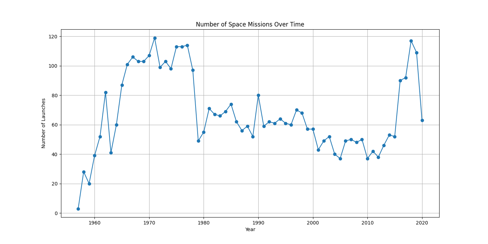
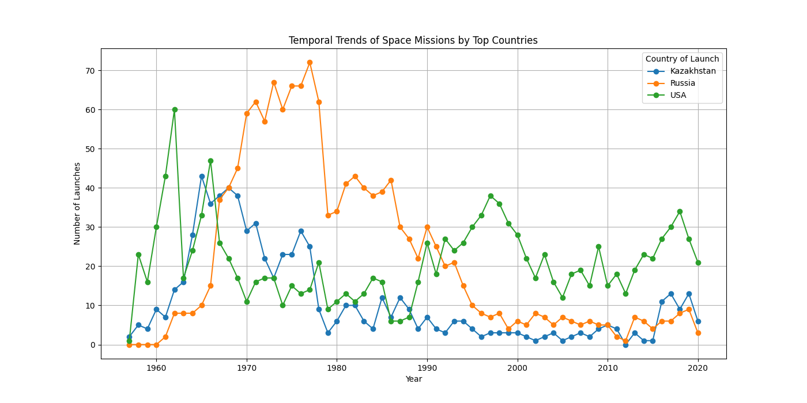
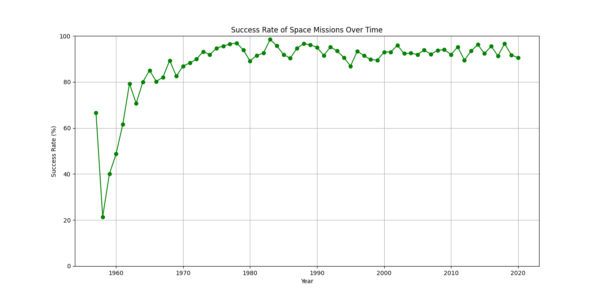
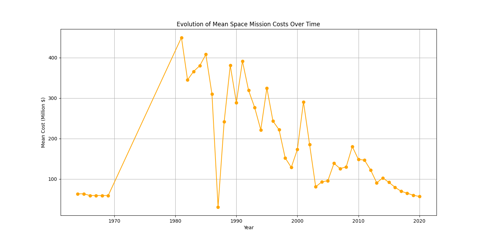
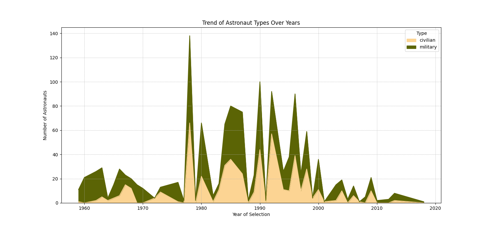
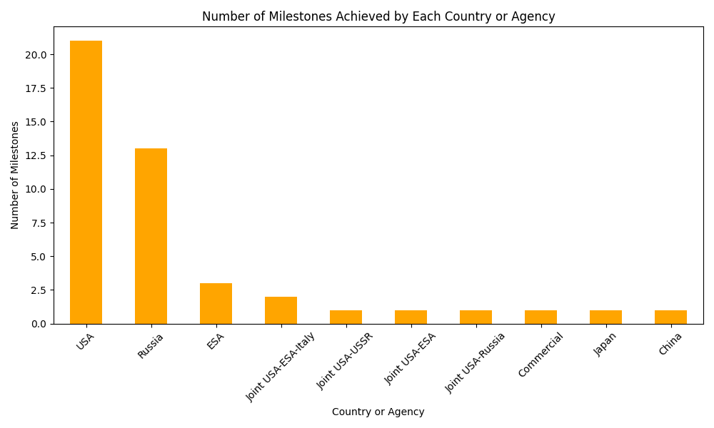

# Project of Data Visualization (COM-480)

| Student's name | SCIPER |
| -------------- | ------ |
| Alexis Firome|314496 |
| Othmane Sqalli Houssaini|246132 |
| Ertugrul Gazi Tekden|352254 |

[Milestone 1](#milestone-1) • [Milestone 2](#milestone-2) • [Milestone 3](#milestone-3)

## Milestone 1 (29th March, 5pm)

**10% of the final grade**

This is a preliminary milestone to let you set up goals for your final project and assess the feasibility of your ideas.
Please, fill the following sections about your project.

*(max. 2000 characters per section)*

### Dataset

The primary dataset we utilize [All Space Missions from 1957 Dataset](https://www.kaggle.com/datasets/agirlcoding/all-space-missions-from-1957/data) offers a comprehensive examination of the evolution of space exploration and its significant milestones. This examination begins with the Soviet Union's pioneering Sputnik launch in 1957, an event that ignited the Space Race primarily between the Soviet Union and the United States. Sourced from Next Spaceflight, our dataset encompasses records of 4,287 space missions, detailing launch dates, mission names, organizing bodies, launch sites, outcomes, mission types, destinations, and available cost data. Below is a sample from the dataset, illustrating the structured information it contains. It's important to note that the dataset is predominantly clean, with only a few entries containing null values.
| Company Name | Location                                              | Datum                       | Detail                                                  | Status Rocket | Rocket | Status Mission |
|--------------|-------------------------------------------------------|-----------------------------|---------------------------------------------------------|---------------|--------|----------------|
| SpaceX       | LC-39A, Kennedy Space Center, Florida, USA            | Fri Aug 07, 2020 05:12 UTC  | Falcon 9 Block 5 / Starlink V1 L9 & BlackSky            | StatusActive  | 50.0   | Success        |
| CASC         | Site 9401 (SLS-2), Jiuquan Satellite Launch Center, China | Thu Aug 06, 2020 04:01 UTC | Long March 2D / Gaofen-9 04 & Q-SAT                     | StatusActive  | 29.75  | Success        |
| SpaceX       | Pad A, Boca Chica, Texas, USA                         | Tue Aug 04, 2020 23:57 UTC  | Starship Prototype / 150 Meter Hop                      | StatusActive  |        | Success        |
| Roscosmos    | Site 200/39, Baikonur Cosmodrome, Kazakhstan          | Thu Jul 30, 2020 21:25 UTC  | Proton-M/Briz-M / Ekspress-80 & Ekspress-103            | StatusActive  | 65.0   | Success        |
| ULA          | SLC-41, Cape Canaveral AFS, Florida, USA              | Thu Jul 30, 2020 11:50 UTC  | Atlas V 541 / Perseverance                              | StatusActive  | 145.0  | Success        |

The supplementary source [Astronaut Database](https://www.kaggle.com/datasets/jessemostipak/astronaut-database) provides a detailed profile of astronauts from NASA, Roscosmos, and fan-based compilations up to January 15, 2020. It captures essential biographical data, including names, gender, birth years, and nationalities, alongside their professional backgrounds, distinguishing between military and civilian careers.

The dataset offers in-depth mission-specific information, including selection details, mission titles, shuttle names, and EVA durations. This rich collection of data not only illuminates the individual journeys of astronauts but also enhances our understanding of the broader narrative of human space exploration, making it an invaluable tool for analysis and research. The absence of empty values in the dataset ensures its cleanliness, thereby requiring minimal filtering to extract the most interesting columns.

### Problematic

Project Overview and Motivation:
Our visualization project delves into the fascinating realm of space exploration, not merely from a technological standpoint but as a reflection of geopolitical development and national prowess. At its core, this project aims to provide a historical narrative, showcasing how pivotal moments in space exploration have been influenced by broader political and societal factors. A significant focus is on the transformative vision set forth by U.S. President John F. Kennedy in the early 1960s, which epitomized the U.S.'s commitment to not just match but surpass Soviet achievements in space. This endeavor underscores a key period in the Space Race, highlighting how Kennedy's ambitious goal of moon landing before the decade's end catalyzed the American space program.

Objectives and Target Audience:
The primary objective is to chart a timeline of crucial milestones in space exploration, illustrating the interplay between technological achievements and their geopolitical implications. By visualizing this timeline, we aim to provide insights into how space exploration has influenced and been shaped by countries' developmental narratives.

Furthermore, the project aims to celebrate the human aspect of space exploration. By profiling the trailblazers – the first astronauts, their backgrounds, occupations, and unique contributions – we offer a tribute to their enduring legacy. This aspect of the visualization seeks to inform and inspire a diverse audience, ranging from space enthusiasts and historians to aspiring engineers and astronauts. It serves as a resource for those curious about the personal journeys of these pioneers and provides context for individuals aiming to contribute to the field of space exploration, whether in astronautics, satellite communication, or related sectors.

### Exploratory Data Analysis

#### Data Pre-processing
As mentioned earlier, our datasets were predominantly clean, necessitating minimal pre-processing. The primary steps we took involved standardizing country names across the datasets to ensure consistency and reformatting certain columns to suit our analysis requirements. Now we can focus on some insightful exploratory data analysis (see more details here : [📓 Data Analysis Notebook](https://github.com/AlexleLion/AOE_Project/blob/master/notebooks/Data%20Analysis.ipynb))

#### Trends of Space Missions Over Time
A closer look at the space missions from the dawn of the Space Age reveals a sharp increase in launches up to the end of the Cold War, a direct result of the USA-USSR rivalry. Post-Cold War, there's a noticeable decline in launch frequency, indicating less geopolitical incentive. Yet, the recent rise suggests a new rise of interest, potentially due to new market players.

Let's deep a bit further and examine the launch trends of the three foremost countries in space exploration: Kazakhstan, Russia, and the USA. The plot below illustrates the temporal trends of space missions by these top countries. Notably, the competition is quite evident with peaks and troughs aligning with significant historical periods.

For instance, Kazakhstan's peak launch activity during the Soviet era reflects its use as the primary launch site of the Soviet space program. Post-Soviet Union dissolution, we observe a decline in launch activity from Kazakhstan, correlating with Russia taking over the space missions previously launched from Kazakh territory. 

The USA shows a steady increase in launches, with periodic spikes that may correspond to specific large-scale space projects or initiatives.

#### Launch Success Rate Trends
The success rate of space missions has seen significant improvement, stabilizing since the 1970s. This progress echoes the advancements in space technology and more robust mission planning.

#### Analysis of Mission Costs
The financial aspect of space missions indicates a decline in average costs, particularly noticeable in the last five years. This trend likely reflects the impact of cost-efficient technologies and the competitive pricing introduced by commercial space companies.

#### Astronaut Selection and Backgrounds
Exploring astronaut data reveals a dominant military presence in the early years, correlating with the militaristic drive of the space race. However, the astronaut corps has diversified over time, with selection peaks possibly tied to heightened periods of space activity.

The fluctuations in astronaut selections over the years may reflect the changing pace and priorities of space exploration efforts. For instance, peaks in astronaut selections could align with periods of increased space activity or the start of new programs requiring fresh batches of astronauts. The decrease in the number of launches observed after the end of the Cold War, followed by recent increases possibly due to commercial space activities, might also influence astronaut selection trends.

#### Space Milestones

To extend our understanding of the trends in space exploration, we have added to our original dataset of space missions a comprehensive list of major milestones in space exploration. By integrating data sourced from [Encyclopedia Britannica's list of major space exploration milestones](https://www.britannica.com/science/space-exploration/Major-milestones)
, we want to draw connections between the number of missions and key historical events. This enriched dataset offers a chronological narrative that showcases the evolution of space exploration, marking the periods of heightened activity and technological breakthroughs.

In enriching our dataset with significant milestones in space exploration, the resulting bar chart sheds light on the achievements among key players in the field. The United States and Russia emerge as historical leaders, a testament to their extensive contributions during the space race era. Intriguingly, the chart reveals that newer entrants such as China and Japan are beginning to claim a share of these milestones. While the chart does not delineate the years of these achievements, we can infer from recent trends in space exploration that many of China's and Japan's milestones likely occurred in the past few years, signaling their rapid advancement and growing influence in the domain. Similarly, contributions from the European Space Agency (ESA) and commercial entities reflect the shift towards more collaborative and privatized space endeavors. This diversity marks a significant change from the Cold War era, where space milestones were primarily a competition between two superpowers. The data underscores the expansion of space exploration ambitions worldwide, promising a future where multiple nations contribute to the milestones of humanity's journey into space.

#### Milestone Significance and Mission Frequency Analysis

In our analysis we have taken a deeper approach by not just cataloging space exploration milestones but also examining the importance of mission activities surrounding these pivotal events. By evaluating the number of missions conducted within a one-year interval of each milestone, we wanted to reveil some patterns that speak volumes about the drive and ambition of spacefaring nations.

The following plots illustrate the dynamic nature of space exploration, reflecting how each leap forward is often supported by a surge in collective efforts to explore the unknown.

.png)

.png)

.png)

Key Observations :
- There are pronounced surges in mission frequency coinciding with groundbreaking milestones, such as the first orbits and landings on celestial bodies like the Moon, Mars, and Venus. This underscores the drive to capitalize on moments of significant advancements.
- Emerging space nations like China and Japan demonstrate a marked increase in activity in recent decades. This uptrend highlights their promising capabilities and escalating engagement in the space sector.
- The progression of milestones over time mirrors the evolution of space technology, shifting from pioneering 'firsts' to more complex and deep-space missions that push the boundaries of human achievement further.

### Related work

> - What others have already done with the data?
> - Why is your approach original?
> - What source of inspiration do you take? Visualizations that you found on other websites or magazines (might be unrelated to your data).
> - In case you are using a dataset that you have already explored in another context (ML or ADA course, semester project...), you are required to share the report of that work to outline the differences with the submission for this class.
>
> Websites about space exploration : 
>   https://education.nationalgeographic.org/resource/history-space-exploration/
>   https://ourworldindata.org/space-exploration-satellites
>   https://science.nasa.gov/solar-system/

## Milestone 2 (26th April, 5pm)

**10% of the final grade**

## Milestone 3 (31st May, 5pm)

**80% of the final grade**

## Late policy

- < 24h: 80% of the grade for the milestone
- < 48h: 70% of the grade for the milestone

